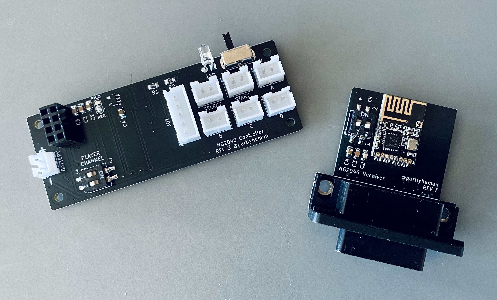
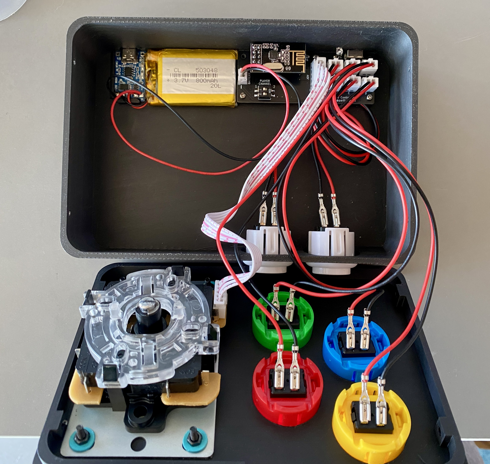

# NG2040
### A pretty cute DIY 2.4GHz wireless controller for Neo Geo

This is a wireless joystick and receiver for Neo Geo consoles that I designed to meet these requirments:

* Super compact
* 3D printable
* Can use cheap Sanwa clones or the real thing
* No (less than 1 frame) of lag
* 2.4GHz radio, no pairing nonsense
* Long battery life with deep sleep
* USB-C rechargeable battery
* Tidy wiring

It uses the ubiquitous RP2040 (specifically, the Waveshare RP2040 Tiny) and Nordic nRF24L01 radios.

## Status

The project is ready for production, but there is a compatibility issue:

The DB15 connectors used are standard depth and work perfectly with supergun setups. However, to use with Neo Geo AES consoles and their extra-deep DB15 ports, a pigtail is required. There are AES specific designs in this repository that can be built using hand-soldered pins and a 3d-printed shroud, but I was never really happy with them, so they're not part of the "official" offering here - feel free to try them out if you so desire, of course.

The joystick design continues on as a BTLE joystick, which can pair with a Neo Geo BlueRetro dongle, any other console with BlueRetro, or your PC! See the ESP.Ra.Dio project here:

## Build instructions

Contact me for purchasing pre-built joysticks, or a build guide will be added to the wiki shortly.