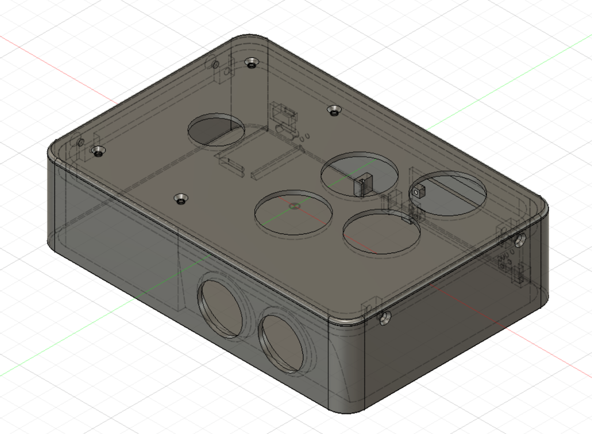
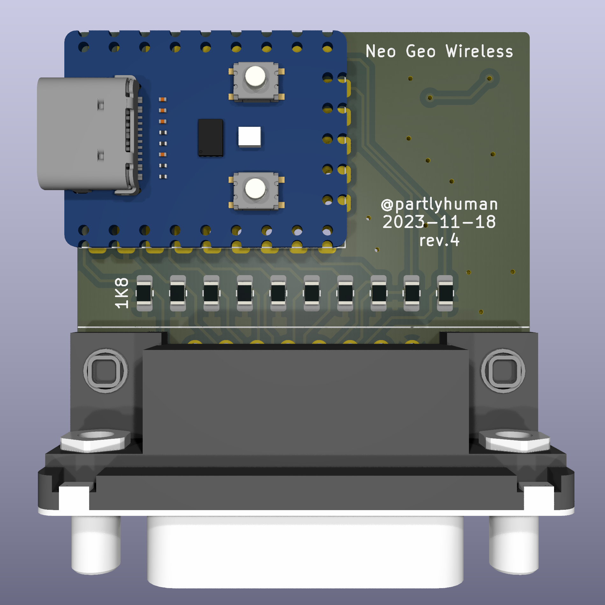

# NG2040
### A pretty cute DIY 2.4GHz wireless controller for Neo Geo

Built around the RP2040 platform and the nRF24L01 SPI radio module, this is a wireless controller and receiver that works with your Neo Geo MVS (or AES? I haven't tried).

The complete system is comprised of:

## Joystick

Has a Raspberry Pi Pico powered by a LiPO battery, a nRF24L01 radio, off-the-shelf 30mm arcade buttons.

The Pico uses deep sleep to conserve battery power when not in use. It automatically sleeps after being idle for 1 minute, and wakes on pressing the start button.

### Software

Flash the software to a Raspberry Pi, a prebuilt image is provided: [nrf24joystick.uf2](blob/main/rp2040/nrf24joystick/nrf24joystick.uf2).

### Hardware

### Case

## Receiver

Uses a custom PCB with a DB15 interface, and for compactness, an RP2040 Zero and SMD nRF24L01 module.

### Software

A little simpler than the sender, without power management. A prebuilt image is provided: [rf24_ng_receiver.ino.uf2](arduino/rf24_ng_receiver/rf24_ng_receiver.ino.uf2)

### Hardware

Gerbers are provided for fabrication.

### Case

The case holds everything in place with no fasteners or glue.