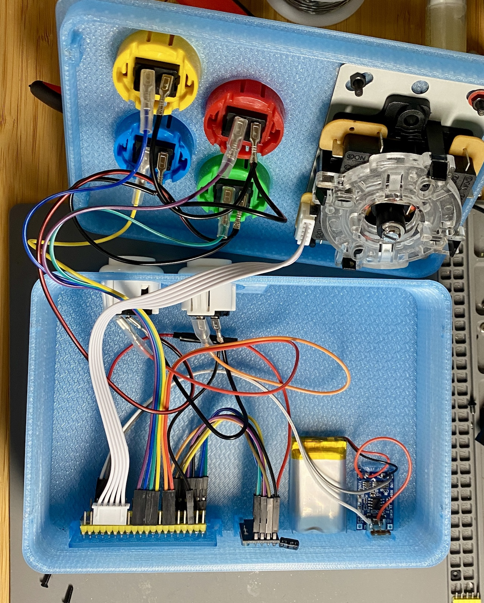

# NG2040
### A pretty cute DIY 2.4GHz wireless controller for Neo Geo

Built around the RP2040 platform and the nRF24L01 SPI radio module, this is a wireless controller and receiver that works with your Neo Geo MVS (or AES? I haven't tried).

The complete system is comprised of:

## Joystick

Has a Raspberry Pi Pico powered by a LiPO battery, a nRF24L01 radio, off-the-shelf 30mm arcade buttons.

### Software

Flash the software to a Raspberry Pi Pico, prebuilt images are provided for [Player 1](arduino/rf24_ng_controller/build/rp2040.rp2040.rpipico/joystick_p1.uf2) and [Player 2](arduino/rf24_ng_controller/build/rp2040.rp2040.rpipico/joystick_p2.uf2).

### Hardware

### Case

Designed to be printable on small FDM printers.

## Receiver

Uses a custom PCB with a DB15 interface, and for compactness, an RP2040 Zero and SMD nRF24L01 module.

### Software

Prebuilt images are provided for [Player 1](arduino/rf24_ng_receiver/build/rp2040.rp2040.waveshare_rp2040_zero/receiver_p1.uf2) and [Player 2](arduino/rf24_ng_receiver/build/rp2040.rp2040.waveshare_rp2040_zero/receiver_p2.uf2).

### Hardware

Gerbers are provided for fabrication.

### Case

The case holds everything in place with no fasteners or glue.

